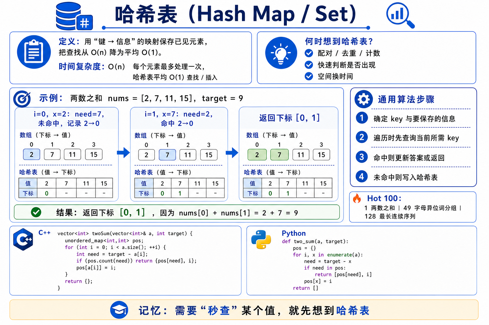
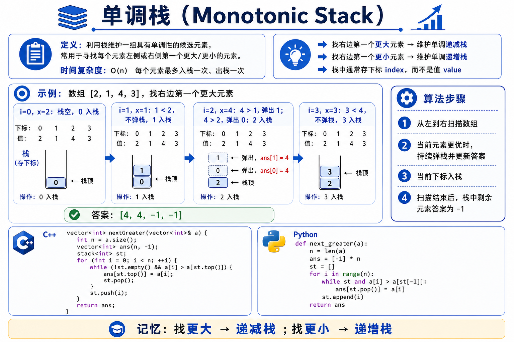
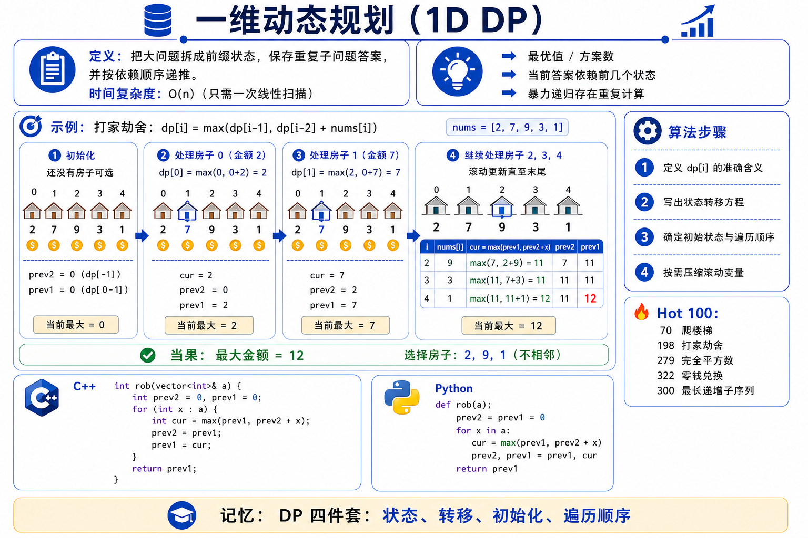
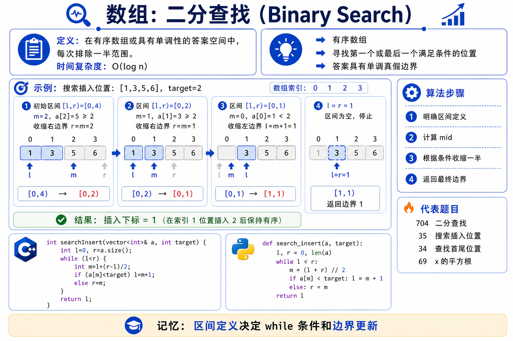
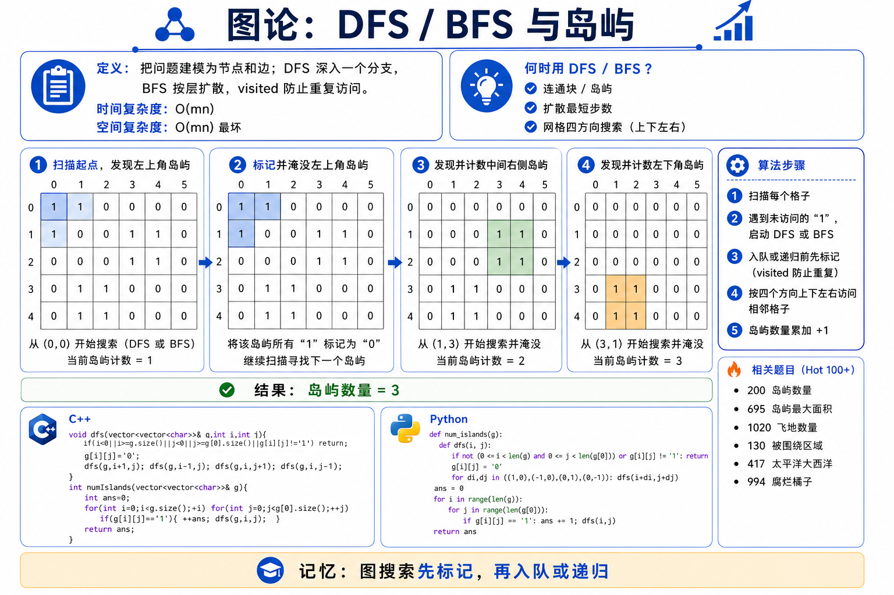

<div align="center">

# 🎴 算法方法图解卡 · Algorithm Method Cards

**把 LeetCode Hot 100 与代码随想录路线的核心算法，做成「一题型一张」的蓝白信息图卡片 + 可放映 PPT**

*Turn the core algorithms of LeetCode Hot 100 & the classic study roadmap into one-card-per-pattern infographics + ready-to-present slides.*

[](https://github.com/zsy00701/algorithm-cards/stargazers)
[](../LICENSE)
[](https://github.com/zsy00701/algorithm-cards/commits)


每张卡含 → **定义 · 识别信号 · 示例图解 · 解题步骤 · C++ / Python 模板 · 记忆口诀**

<sub>⭐ 觉得有用的话点个 Star，方便随时回来复习！ · Star it if it helps your interview prep!</sub>

</div>

---

## 💡 为什么做这个

刷题最大的痛点不是不会写，而是**题型对不上方法**。这套卡把每个高频套路压缩成一页：看到题先想「这是哪一类」，再调出对应的识别信号、模板和口诀——**面试前一天就能快速过一遍全图谱**。

- 🎯 **按套路组织**：54 个方法专题，覆盖数组到图论的完整知识树
- 🖼 **图解 + 模板**：每张卡都有示例推演图 + C++ / Python 双语代码
- 📊 **开箱即用**：2 套方法卡 PPT，投屏 / 打印 / 复习直接用
- ✅ **内容可信**：核心版本由源数据确定性渲染，数字与代码经校验

---

## 🖼 卡片样张

<div align="center">



<table>
<tr>
<td width="50%"></td>
<td width="50%"></td>
</tr>
<tr>
<td width="50%"></td>
<td width="50%"></td>
</tr>
</table>

</div>

---

## 📥 成品下载（PPT）

> 点文件名 → 进入页面后点 **Download** 即可下载放映。

**力扣 Hot 100（18 讲）**

| 成品 | 说明 |
|------|------|
| [Hot100方法卡_gpt-image-2.pptx](ppt_output/Hot100方法卡_gpt-image-2.pptx) | 18 张方法卡，GPT-Image-2 信息图 |
| [Hot100分类总览.pptx](ppt_output/Hot100分类总览.pptx) | 题型分类总览，建立全局认知 |

**代码随想录路线（36 讲）**

| 成品 | 说明 |
|------|------|
| ⭐ [代码随想录算法分类图解_顺序版.pptx](ppt_output/代码随想录算法分类图解_顺序版.pptx) | 按学习路线顺序排列 —— **系统刷题首选** |
| [代码随想录算法卡_gpt-image-2.pptx](ppt_output/代码随想录算法卡_gpt-image-2.pptx) | 36 张方法卡，GPT-Image-2 信息图 |

---

## ✨ 两套卡集

| 卡集 | 数量 | 覆盖 |
|------|:---:|------|
| **力扣 Hot 100 方法卡** | 18 | 哈希 / 双指针 / 滑窗 / 二叉树 / DP / 单调栈 … |
| **算法分类方法卡（代码随想录路线）** | 36 | 数组 → 链表 → 树 → 回溯 → DP → 图论 全覆盖 |

卡片图为 GPT-Image-2 信息图；附带脚本可由源数据重渲高清版、导出原生可编辑 PPT。

> ⚠️ `carl_algorithm_cards/QA_REPORT.md` 记录了卡片内容核查情况。

---

## 🚀 自己重新生成

```bash
pip install python-pptx pillow

python scripts/render_hires_cards.py     # Hot100 高清卡 + PPT
python scripts/build_editable_decks.py   # 两套原生可编辑 PPT
python scripts/images_to_pptx.py         # 各版本图片 → PPT
```

| 脚本 | 作用 |
|------|------|
| `hot100_method_cards/render_method_cards.py` | 由源数据渲染 Hot100 信息图卡（含示例图解） |
| `render_hires_cards.py` | 复用同款布局，2× 高清重渲并打包 PPT |
| `card_deck_engine.py` | 原生可编辑 PPT 建版引擎 |
| `carl_cards_data.py` | 36 讲卡片的结构化内容数据 |
| `build_editable_decks.py` | 一键生成两套原生可编辑 PPT |
| `images_to_pptx.py` | 任意一组卡片图片 → PPT |

---

## 🗂 目录结构

```
.
├── hot100_method_cards/   # Hot100 方法卡（18）：gpt-image-2 / 渲染脚本
├── carl_algorithm_cards/  # 代码随想录算法卡（36）：gpt-image-2 / 预览拼图 / QA 报告
├── hot100_images/         # Hot100 题型分类总览图
├── ppt_output/            # 所有打包好的 .pptx 成品
└── scripts/               # 生成脚本（渲染卡片、打包 PPT）
```

---

## 📚 收录题型

<details>
<summary><b>力扣 Hot 100 · 18 个方法专题</b></summary><br>

哈希表 · 双指针 · 滑动窗口 · 前缀和+哈希 · 排序+区间 · 矩阵模拟 · 链表 · 二叉树 DFS/BFS · 图搜索 · 回溯 · 二分查找 · 栈 · 单调栈 · 堆/优先队列 · 贪心 · 一维 DP · 二维 DP · 位运算与数学技巧
</details>

<details>
<summary><b>代码随想录路线 · 36 个专题</b></summary><br>

数组（二分 / 双指针 / 滑窗 / 前缀和 / 矩阵）· 链表（虚拟头 / 反转 / 环）· 哈希表 · 字符串（反转旋转 / KMP）· 栈与队列（模拟 / 括号 / 单调队列）· 堆 · 二叉树（遍历 / 层序 / 属性路径 / BST）· 回溯（组合 / 子集排列 / 剪枝去重 / 棋盘）· 贪心（序列 / 区间）· 动态规划（网格 / 01背包 / 完全背包 / 打家劫舍 / 股票 / 子序列编辑距离 / 回文）· 单调栈 · 图论（DFS/BFS / 并查集拓扑MST / 最短路）
</details>

---

<div align="center">

如果这套卡帮你省了复习时间，**点个 ⭐ Star** 就是最好的支持！

<sub>MIT License · 仅用于算法学习与复习<br>代码随想录路线仅作知识点组织参考，卡片为独立设计与独立文案</sub>

</div>
